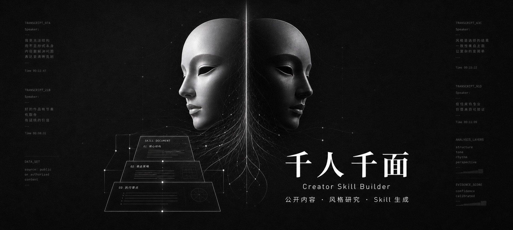

<p align="center">
  
</p>

<h1 align="center">千人千面 / Thousand Faces</h1>

<p align="center">
  <strong>把创作者的公开表达风格，沉淀成可以被理解、复用、审查和进化的 Creator Skill。</strong>
  <br />
  <sub>Clone a creator's public style into an evidence-based, reusable AI Skill.</sub>
</p>

<p align="center">
  开源的创作者风格研究流水线 · 公开内容 · 风格克隆 · 证据化 Skill
</p>

<p align="center">
  
  
  
  
</p>

<br />

<table align="center">
  <tr>
    <td align="center" width="33%">
      <sub>BUFFON</sub>
      <br />
      <strong>Le style est l'homme même.</strong>
      <br />
      <sup>风格即其人。</sup>
    </td>
    <td align="center" width="33%">
      <sub>MARSHALL McLUHAN</sub>
      <br />
      <strong>The medium is the message.</strong>
      <br />
      <sup>媒介本身，就是信息。</sup>
    </td>
    <td align="center" width="33%">
      <sub>LUDWIG WITTGENSTEIN</sub>
      <br />
      <strong>The limits of my language mean the limits of my world.</strong>
      <br />
      <sup>语言的边界，就是世界的边界。</sup>
    </td>
  </tr>
</table>

<br />

<p align="center">
  <strong>千人千面不是在制造替身。</strong>
  <br />
  它是在把风格从内容流里打捞出来，把方法交还给创作者，把表达变成一种可以长期生长的资产。
</p>

<p align="center">
  <a href="#项目描述">项目描述</a> ·
  <a href="#产品宣言">产品宣言</a> ·
  <a href="#为什么它重要">为什么重要</a> ·
  <a href="#从内容到-skill">工作流</a> ·
  <a href="#边界">边界</a> ·
  <a href="#给开发者的最短依赖">开发者入口</a>
</p>

<br />

<table>
  <tr>
    <td align="center" width="25%">
      <sub>POSITIONING</sub>
      <br />
      <strong>创作者风格资产化</strong>
    </td>
    <td align="center" width="25%">
      <sub>INPUT</sub>
      <br />
      <strong>公开或授权内容</strong>
    </td>
    <td align="center" width="25%">
      <sub>OUTPUT</sub>
      <br />
      <strong>Creator Skill</strong>
    </td>
    <td align="center" width="25%">
      <sub>STANCE</sub>
      <br />
      <strong>Human-first AI</strong>
    </td>
  </tr>
</table>

## 项目描述

千人千面（Thousand Faces）是一个开源的创作者风格研究与 Creator Skill 生成项目。

它从公开或授权的创作者内容出发，通过作品采集、音视频处理、ASR 转写、风格研究、证据索引和质量审查，理解一个人长期稳定的表达方式：他如何选题，如何开头，如何推进观点，如何处理情绪，如何建立信任，如何形成自己的内容判断。然后，它把这些模糊却珍贵的东西整理成一个可被 Agent 调用、复盘和持续进化的风格能力包。

它不是为了复制谁本人。

它是为了让一个人的公开表达风格和创作方法被看见、被保存、被复用。

## 产品宣言

这个时代不缺内容。

缺的是能被继承的方法，能被解释的风格，能经得起复盘的判断。

我们每天都在生产新的文本、新的视频、新的观点，但太多真正重要的东西会被流量冲走：一个创作者如何建立信任，如何拿捏分寸，如何把复杂问题讲得有温度，如何在相似的热点里说出属于自己的判断。

千人千面要做的，是把这些隐性的能力从作品里提取出来。

不是把人变成模型，而是让人的方法不再消失。

不是让 Agent 替谁发声，而是让 Agent 学会尊重一个人的表达结构。

不是追求廉价的“像”，而是追求有证据、有边界、有灵魂的个性化协作。

## 为什么它重要

每个成熟创作者身上，都有一套看不见的系统。

观众看到的是一条条视频、一次次表达、一个个爆款。但真正决定内容质量的，往往不是某一句金句，而是背后的判断力：

- 什么话题值得讲。
- 什么开头能让人留下来。
- 什么节奏能让观点更有力量。
- 什么案例能让抽象概念落地。
- 什么边界不能越过。
- 什么语气才像“这个人”。

这些能力以前通常只能留在创作者脑子里，或者散落在团队经验、口头复盘和零碎文档里。时间一长，风格会丢，方法会散，团队新人只能靠感觉模仿。

千人千面想做的事很简单，也很有野心：

让创作者的表达能力变成一种长期资产。

## 它真正生成的不是文案

千人千面生成的不是一篇仿写稿，也不是一个“像某某一样说话”的提示词。

它生成的是 Creator Skill。

一个好的 Creator Skill 应该像一份创作者的表达说明书：

- 它知道这个创作者通常关注什么问题。
- 它知道这个创作者如何判断选题价值。
- 它知道这个创作者如何组织一条内容。
- 它知道这个创作者的语气、节奏、结构和禁区。
- 它知道哪些结论有证据，哪些只是推测。
- 它知道自己不能冒充本人。

这让 Agent 不再只是“临时写一篇”，而是拥有可持续调用的风格上下文。

## 不只是 Prompt

<table>
  <tr>
    <th align="left">普通仿写 / Prompt</th>
    <th align="left">千人千面</th>
  </tr>
  <tr>
    <td>追求表层相似：语气词、口头禅、高频词。</td>
    <td>追求结构理解：选题、论证、节奏、边界和判断力。</td>
  </tr>
  <tr>
    <td>一次性生成，用完即散。</td>
    <td>沉淀为 Creator Skill，可以反复调用、审查和迭代。</td>
  </tr>
  <tr>
    <td>容易滑向“像某个人说话”。</td>
    <td>明确声明辅助创作，不冒充本人，不伪造身份。</td>
  </tr>
  <tr>
    <td>依赖感觉和风格标签。</td>
    <td>保留证据索引，让判断有来处，让修改有依据。</td>
  </tr>
</table>

## 适合谁

### 创作者

如果你已经积累了一批公开作品，千人千面可以帮你把自己的表达方法整理出来。

不是把你变成模板，而是把你已经形成的能力变得更清楚：你擅长什么，你反复使用什么结构，你为什么能打动观众，你的内容边界在哪里。

### 内容团队

如果你在做账号矩阵、达人孵化、MCN 内容管理或品牌内容团队，千人千面可以把经验从“靠老人带新人”变成“有结构可复用”。

新人不必只靠猜测去模仿风格，团队也不必每次都从零解释选题逻辑和脚本节奏。

### Agent 使用者

如果你希望 Agent 帮你选题、改稿、写口播脚本、点评内容，千人千面可以给 Agent 一份更稳定的风格底座。

它让 Agent 不只是回答问题，而是带着一个创作者的内容系统去协作。

## 这个项目相信什么

<table>
  <tr>
    <td width="33%" valign="top">
      <sub>01 / 正名</sub>
      <br />
      <strong>名不正，则言不顺。</strong>
      <br /><br />
      个性化的第一步不是模仿，而是把“这个 Skill 到底是什么”说清楚。它是研究助手，不是身份替身；是创作基础设施，不是人格复制器。
    </td>
    <td width="33%" valign="top">
      <sub>02 / 形式</sub>
      <br />
      <strong>Form ever follows function.</strong>
      <br /><br />
      一个 Creator Skill 的形态，应该从它要承担的工作长出来：选题、结构、语气、边界、证据，而不是从几个漂亮标签拼出来。
    </td>
    <td width="33%" valign="top">
      <sub>03 / 留白</sub>
      <br />
      <strong>不是所有东西都该被生成。</strong>
      <br /><br />
      好的个性化系统，必须知道哪里应该表达，哪里应该克制，哪里应该拒绝。边界不是限制创造力，边界是长期信任的形状。
    </td>
  </tr>
</table>

### 风格不是皮肤，是结构

真正的风格不只是口头禅、语气词和几个高频词。

风格是一个人如何观察世界、如何选择问题、如何安排论证、如何表达立场、如何控制分寸。

所以千人千面关注的不只是“说得像”，而是“想得像、组织得像、判断得像”，并且始终保留证据和边界。

### 个性化不是贴标签

一个人不应该被压缩成几个粗糙标签。

千人千面希望生成的是细腻的、多层次的风格画像：既包含主题偏好，也包含结构习惯；既包含表达 DNA，也包含内容禁区；既能辅助创作，也能提醒风险。

### 辅助创作不是身份冒充

Creator Skill 是风格研究助手，不是创作者本人。

它可以帮助整理选题、生成草稿、优化结构、提供风格点评，但不应该声称代表创作者本人发言，也不应该用于伪造授权、背书、私密观点或身份关系。

千人千面要做的是放大方法，不是伪造身份。

## 从内容到 Skill

千人千面围绕一条完整的创作者风格资产化链路展开：

<table>
  <tr>
    <td align="center"><sub>01</sub><br /><strong>创作者主页</strong></td>
    <td align="center"><sub>02</sub><br /><strong>公开作品采集</strong></td>
    <td align="center"><sub>03</sub><br /><strong>视频与音频处理</strong></td>
    <td align="center"><sub>04</sub><br /><strong>内容转写</strong></td>
  </tr>
  <tr>
    <td align="center"><sub>05</sub><br /><strong>风格研究</strong></td>
    <td align="center"><sub>06</sub><br /><strong>证据索引</strong></td>
    <td align="center"><sub>07</sub><br /><strong>Creator Skill</strong></td>
    <td align="center"><sub>08</sub><br /><strong>Agent 协作</strong></td>
  </tr>
</table>

这条链路的意义不在于“自动化抓取”，而在于把内容背后的创作能力一步步萃取出来。

最终产物不是一堆素材，而是一套可被继续审查、修改和进化的创作者能力模型。

## Creator Skill 能做什么

先说清楚两个概念。

**Creator Skill** 是最终产物。它不是一篇提示词，也不是一份单次生成的文案，而是一组可以被 Agent 加载和反复调用的风格能力文件：通常包含 `SKILL.md`、创作者画像、选题模型、脚本结构、表达 DNA、证据索引、安全边界和结构化 `persona_model.json`。它的作用是让 Agent 在选题、写稿、改写和风格点评时，拥有一套稳定的创作者风格上下文。

**千人千面** (**Thousand Faces**) 是生成 Creator Skill 的项目和流水线。它负责从公开或授权内容出发，完成作品采集、音视频处理、ASR 转写、风格研究、证据整理、质量检查和宿主 Agent 精修，最后输出一个可用的 Creator Skill。换句话说，千人千面 是“工厂”和方法论，Creator Skill 是每次为某个创作者生成出来的“风格能力包”。

一个经过整理的 Creator Skill 可以帮助完成：

- 选题建议：判断什么话题适合这个创作者。
- 脚本结构：给出更接近其表达方式的内容骨架。
- 口播草稿：生成可继续人工修改的初稿。
- 内容改写：让已有文本更贴近目标风格。
- 风格点评：指出哪里不像、哪里过度、哪里越界。
- 团队交接：把隐性的创作经验沉淀成文档化资产。

它最适合成为创作流程里的第二大脑，而不是替代创作者本人。

## 边界

千人千面默认站在创作者和内容团队这一边。

它应该帮助人更好地理解自己的表达，而不是让别人偷走一个人的身份。

因此，生成的 Creator Skill 应始终遵守：

- 只基于公开内容或已授权材料。
- 不声称“我是该创作者”。
- 不代表创作者本人发布声明。
- 不伪造授权、合作、背书或商业关系。
- 不推断隐私、私密观点或未公开经历。
- 不用于声音克隆、形象克隆、数字人冒充。
- 不把大段原始转写稿塞进 Skill。

有边界，才有长期价值。

## 当前形态

这个仓库当前提供的是一个 Skill-first 的 Thousand Faces。

<table>
  <tr>
    <td width="50%" valign="top">
      <sub>PRODUCT SURFACE</sub>
      <br />
      <strong>一个可运行的 Skill 构建器</strong>
      <br /><br />
      面向创作者主页、公开作品、转写文本和风格研究，输出可被宿主 Agent 调用的 Creator Skill。
    </td>
    <td width="50%" valign="top">
      <sub>DESIGN CENTER</sub>
      <br />
      <strong>稳定产物，而不是一次性生成</strong>
      <br /><br />
      保留中间材料、证据索引、质量检查和安全边界，让每一次生成都可以复盘、校正、迭代。
    </td>
  </tr>
</table>

核心目录：

```text
.
  README.md
  SKILL.md
  requirements.txt
  agents/
  scripts/
  references/
  docs/
    assets/
      readme/
        qianrenqianmian-promo-20x9.png
```

它已经包含：

- 从抖音创作者主页构建 Creator Skill 的流程说明。
- TikHub、阿里云 Qwen-ASR、ffmpeg 等运行配置。
- 视频采集、下载、抽音频、转写、摘要、质量检查等脚本。
- Creator Skill 的产物结构和安全边界。

默认生成的运行产物会放在：

```text
runs/<project-name>/<run-id>/
```

其中最重要的是：

```text
skill/
  SKILL.md
  references/
    persona.md
    topic_model.md
    script_style.md
    research_summary.md
    evidence_index.md
    meta.json
```

## 给开发者的最短依赖

最短依赖很简单：把这个项目发给 AI，让它根据你的环境、凭证和目标创作者帮你完成配置。

如果 AI 需要更多上下文，可以把这些文件一起交给它：

- `references/pipeline.md`
- `references/configuration.md`

## 愿景

未来，每个创作者都应该拥有自己的表达资产。

不是一个冷冰冰的人设标签，不是一套偷懒的仿写模板，而是一份真正理解其创作方法的 Skill：能解释、能复用、能校正、能进化，也知道哪些地方必须保持沉默。

千人千面想做的，就是把创作者身上那些长期积累、难以言说、但极其宝贵的能力，从内容流里提取出来，变成可以和 Agent 一起工作的创作基础设施。

<p align="center">
  <strong>如果内容是一个人留在世界上的回声，</strong>
  <br />
  千人千面想保存的，不只是回声本身，而是那个让回声成立的方法。
</p>

---

<p align="center">
  <sub>THE END IS THE BEGINNING</sub>
  <br />
  <strong>让 Agent 学会风格，让创作者保有主体。</strong>
  <br />
  让技术靠近人，而不是替代人。
  <br />
  让风格不只被消费，让方法被留下。
</p>

## 题记来源

- Georges-Louis Leclerc, Comte de Buffon: [Discours sur le style](https://athena.unige.ch/athena/buffon/buffon-discours-sur-le-style.pdf)
- Marshall McLuhan: [Understanding Media](https://web.mit.edu/allanmc/www/mcluhan.mediummessage.pdf)
- Ludwig Wittgenstein: [Tractatus Logico-Philosophicus 5.6](https://www.gutenberg.org/files/5740/5740-pdf.pdf)
- Confucius: [The Analects](https://www.goodreads.com/quotes/1337998-if-names-be-not-correct-language-is-not-in-accordance)
- Louis H. Sullivan: [The Tall Office Building Artistically Considered](https://archive.org/details/tallofficebuildi00sull/page/n3/mode/2up)

## 开源协议

本项目基于 [MIT License](LICENSE) 开源。

你可以自由使用、复制、修改、合并、发布、分发、再授权或销售本项目的软件副本，但请保留原始版权声明和许可声明。项目按“原样”提供，不附带任何形式的明示或暗示担保。

## 最后的说明

开源之所以伟大，不只是因为代码可以被看见，更因为知识可以被传递，经验可以被复用，错误可以被共同修正，后来者可以站在前人的肩膀上继续往前走。

千人千面愿意把自己的方法、边界、流程和思考放到阳光下，也愿意接受来自真实使用者、开发者、创作者和研究者的审视与改进。

愿这个项目不只是一个工具，而是一块开放的地基。愿我们和所有认真创造、认真建设的人一起进步。

## 致谢

感谢 [titanwings/colleague-skill](https://github.com/titanwings/colleague-skill) 带来的启发。

它让我们重新看见，Skill 不只是调用模型的说明书，也可以是一种把人的经验、判断、工作方式和协作秩序沉淀为可复用能力的媒介。

千人千面在这个思考上继续向前一步：从工作关系中的能力沉淀，走向公开表达中的风格研究；从经验的复用，走向证据化、可审查、可进化且守住边界的创作基础设施。

好的开源项目会照亮后来者。我们感谢这种照亮，也愿意把新的火光继续传下去。
